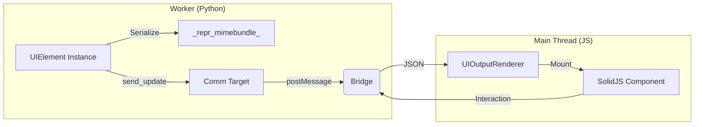

# UI System Master Specification

**Scope:** The end-to-end architecture of the custom UI system, from Python class definition to SolidJS rendering.

## Core Philosophy

The PyNote UI system uses a **Remote Handle Pattern**. 
*   **The Handle:** A Python object instance (`UIElement`) that lives in the Pyodide heap. It holds state but does not render anything itself.
*   **The View:** A SolidJS component that lives in the main thread's DOM. It renders based on state provided by the handle and sends user interactions back to it.

This separation allows us to leverage the rich ecosystem of web UI libraries (SolidJS, DaisyUI, Tailwind) while keeping the logic in Python, which is the native language of the notebook user.

## System Architecture

## Key Modules

### 1. Python Package (`pynote_ui`)
*   **`core.py`**: Contains `UIElement` (base class) and `StateManager` (registry & GC).
*   **`elements.py`**: Library of ready-to-use widgets (e.g., `Slider`).

### 2. Frontend Renderer (`src/components/ui-renderer`)
*   **`UIOutputRenderer.tsx`**: The entry point. It receives the JSON payload from the execution result and decides what to render.
*   **`ComponentRegistry.tsx`**: A mapping from string types (e.g., "Slider") to Lazy-loaded SolidJS components.
*   **`utils.ts`**: Helpers for theming and style projection.

## Lifecycle

1.  **Creation:** User runs `Slider()`. Python creates an instance, generates a UUID, and registers it with `StateManager`.
2.  **Display:** The cell outputs a MIME bundle. `UIOutputRenderer` mounts the corresponding Solid component.
3.  **Hydration:** The Solid component connects to the `kernel` using the UUID to listen for updates.
4.  **Interaction:** User drags slider -> JS sends `interaction` event -> Python updates state.
5.  **Destruction:** When the cell is re-run or deleted, `StateManager` garbage collects the Python instance, and Solid cleans up the DOM component.
